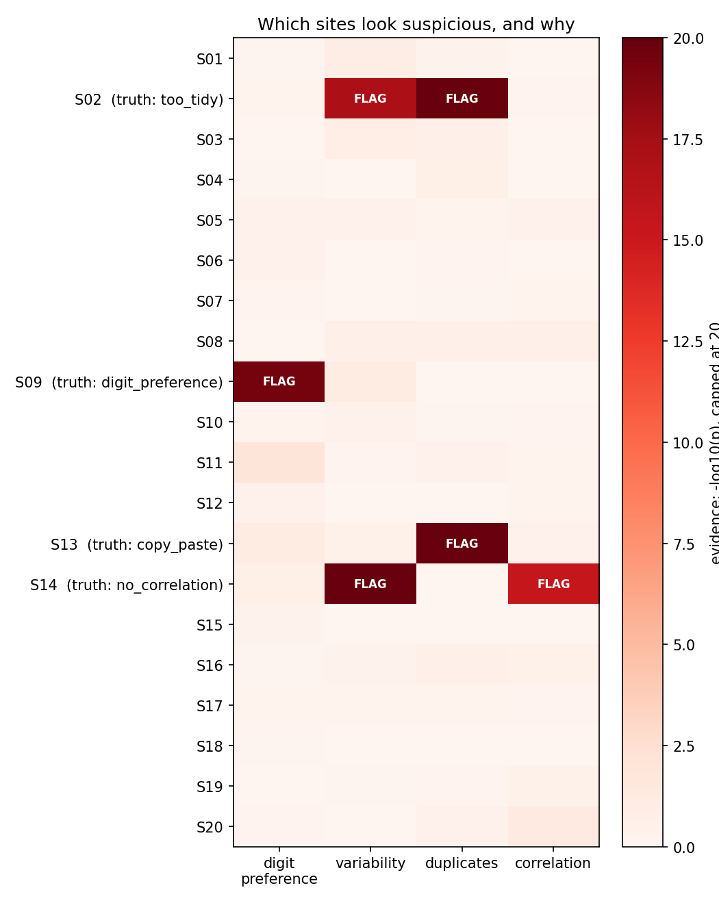
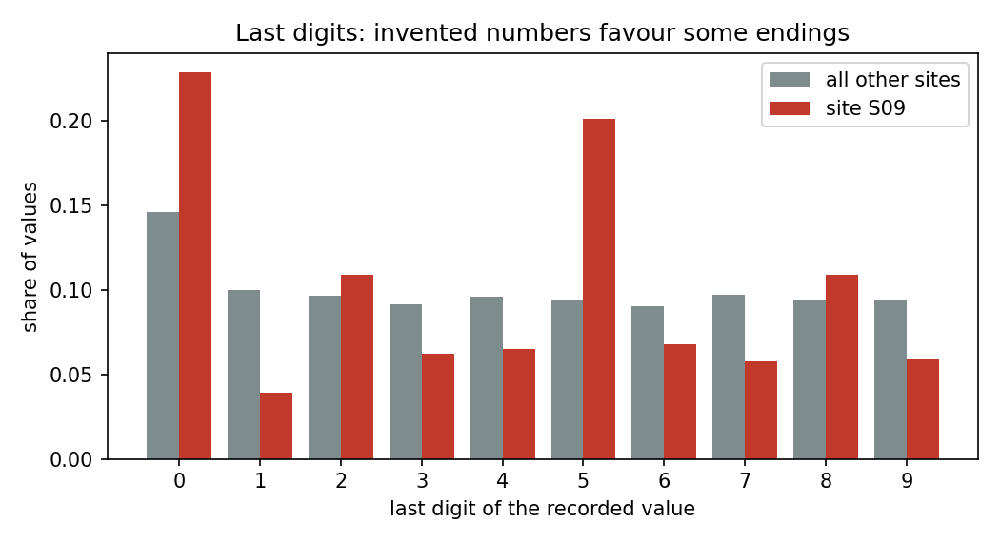
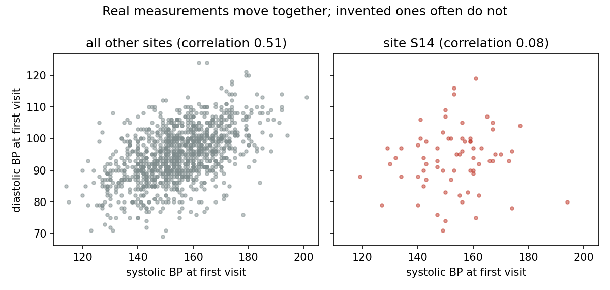
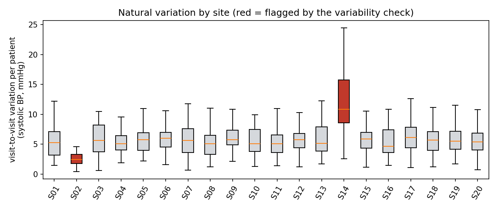

# Trial Data Detective

[](https://github.com/YOUR_USERNAME/trial-data-detective/actions)

Catch hospitals that fake their data in a clinical trial, using statistics alone.

Big clinical trials collect data from many hospitals ("sites"). Occasionally a site invents
patient data instead of collecting it. Invented numbers leave fingerprints, and regulators
(FDA, EMA, ICH E6) encourage sponsors to look for them with *central statistical monitoring*.
This project is a small, readable implementation of that idea in Python:

1. **Simulate** a realistic 20-site blood-pressure trial in which a few sites cheat.
2. **Detect** the cheaters without looking at the answer key.
3. **Explain** each flag with a chart.



## The four fingerprints

| How the site cheats | What gives it away | Statistical check |
|---|---|---|
| A person makes numbers up | Too many values ending in 0 or 5 | Chi-square test on last digits, corrected for normal site-to-site rounding habits |
| Values are "too tidy" | Too little natural variation | Brown-Forsythe test between patients, Mann-Whitney test within patients |
| Patients are copy-pasted with small edits | Some patients are near-twins | Nearest-neighbour distances compared with random groups from other sites |
| Each number is invented separately | Natural relationships are missing (e.g. systolic vs diastolic pressure) | Fisher z-test against the median of other sites |

Every site is compared with the rest of the trial, and the 80 resulting p-values
(20 sites x 4 checks) are corrected with the Benjamini-Hochberg procedure so that testing
many things does not produce a pile of false alarms.

| | |
|---|---|
|  |  |



## Results

Benchmark over 200 simulated trials (`trial-detective benchmark --trials 200`), each with
16 honest sites and one site of each fraud type:

| Site type | Sites | Flagged | Rate |
|---|---|---|---|
| Digit preference | 200 | 200 | 100% |
| Too tidy | 200 | 200 | 100% |
| Copy-paste | 200 | 200 | 100% |
| No correlation | 200 | 200 | 100% |
| **Honest (false alarms)** | 3200 | 51 | **1.6%** |

These numbers describe the simulated fraud in this repository, which is fairly blatant.
See the limitations below before reading them as real-world accuracy.

## Quick start

```bash
git clone https://github.com/YOUR_USERNAME/trial-data-detective.git
cd trial-data-detective
pip install -e ".[dev]"

trial-detective simulate --seed 42 --out output
trial-detective detect output/trial.csv --truth output/truth.csv --out output/report
```

This prints the flagged sites and writes `output/report/report.md` with all four charts.
A ready-made example is in [`examples/`](examples/example_report.md).

Use it from Python:

```python
from trial_detective import TrialConfig, simulate_trial, run_all, evaluate

data, truth = simulate_trial(TrialConfig(seed=42))
result = run_all(data)          # one row per site, most suspicious first
print(evaluate(result, truth))  # recall, precision, false positive rate
```

### Using your own data

`detect` accepts any CSV with one row per patient visit and these columns:
`site_id, patient_id, arm, visit_week, sbp, dbp, hr`. The `--truth` file is optional.

## Project layout

```
src/trial_detective/
  simulate.py    builds the pretend trial and the cheating sites
  detectors.py   the four statistical checks
  scoring.py     multiple-testing correction, evaluation, benchmark
  plots.py       evidence charts
  cli.py         command line tool
tests/           pytest suite (runs on every push via GitHub Actions)
```

## Limitations

- All data is simulated. The detectors were designed alongside the fraud they detect, so
  the benchmark is optimistic. Real fabrication is subtler and more varied.
- A flag means "worth a closer look", never "guilty". Honest sites can differ for innocent
  reasons (different equipment, patient mix, rounding habits).
- The copy-paste p-value uses a normal approximation to a Monte Carlo reference
  distribution, and all p-values are capped at 1e-20.
- Measurement columns are specific to a blood-pressure trial. Other trial types need the
  column list in `detectors.py` adapted.

## Ideas for extension

- Subtler fraud (e.g. only 10% of values invented) and power curves showing where detection breaks down
- More checks: visit dates falling on weekends, adverse-event under-reporting, Benford's law for lab values
- A Streamlit dashboard for interactive review

## Background reading

- Buyse M. et al. (1999). The role of biostatistics in the prevention, detection and treatment of fraud in clinical trials. *Statistics in Medicine*.
- Venet D. et al. (2012). A statistical approach to central monitoring of data quality in clinical trials. *Clinical Trials*.
- ICH E6 Good Clinical Practice guideline, sections on risk-based and centralized monitoring.

## License

MIT
